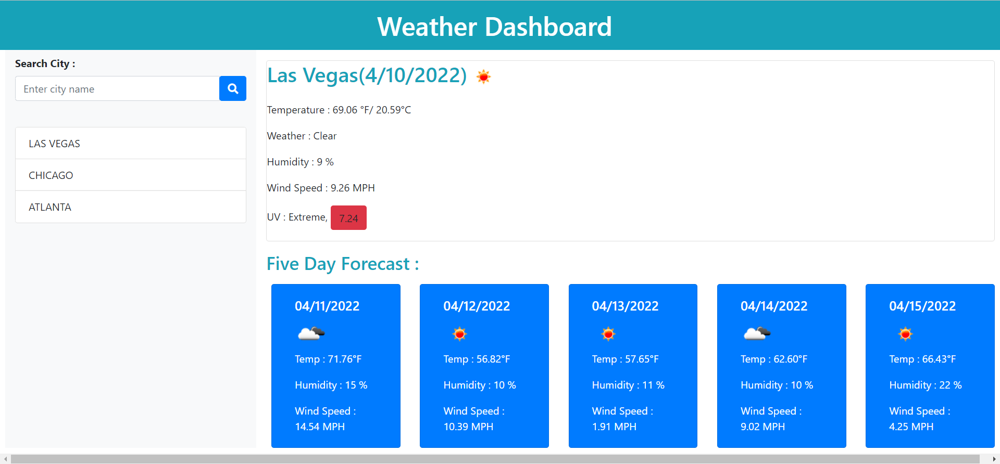

# Weather-Dashboard
Server side API
## Description
Third-party APIs allow developers to access their data and functionality by making requests with specific parameters to a URL. We had to build a weather dashboard that will get the data from openweathermap API  that will run in the browser and feature dynamically updated HTML and CSS.

## User Story
AS A traveler
I WANT to see the weather outlook for multiple cities
SO THAT I can plan a trip accordingly
## Expected Goals

GIVEN a weather dashboard with form inputs
WHEN I search for a city
THEN I am presented with current and future conditions for that city and that city is added to the search history
WHEN I view current weather conditions for that city
THEN I am presented with the city name, the date, an icon representation of weather conditions, the temperature, the humidity, the wind speed, and the UV index
WHEN I view the UV index
THEN I am presented with a color that indicates whether the conditions are favorable, moderate, or severe
WHEN I view future weather conditions for that city
THEN I am presented with a 5-day forecast that displays the date, an icon representation of weather conditions, the temperature, the wind speed, and the humidity
WHEN I click on a city in the search history
THEN I am again presented with current and future conditions for that city

## Steps taken

* I have created an API key to access the openweathermap API which will give me the current weather conditions of a city.
* As a valid city is searched, its temperature,humidity,uv index,wind speed, 5day forecast will be dynamically added on the cards on dashboard.
* Local storage is used to store the searched cities, which are also displaying in the list.

## Screenshots

## Deployed Application

https://bhavnao.github.io/Weather-Dashboard/
